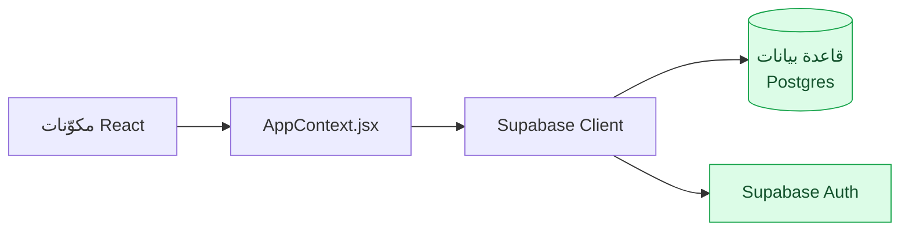
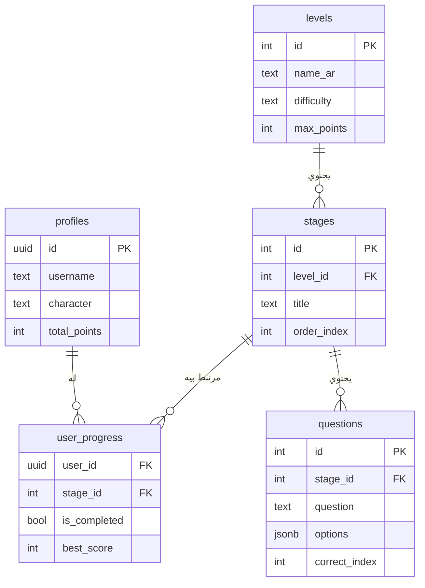
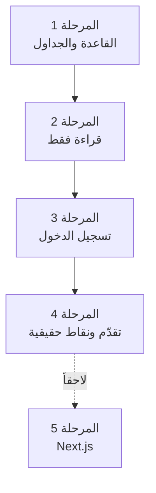
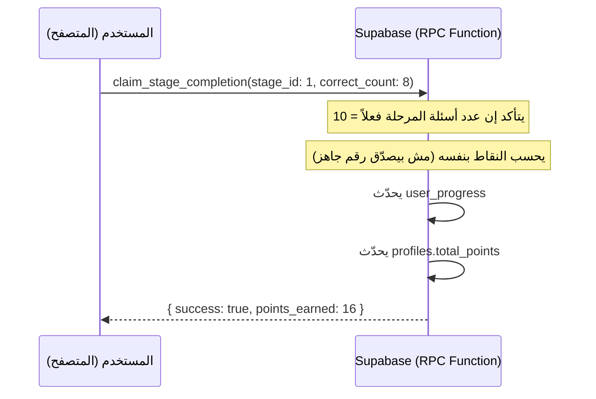

# دليل الانتقال لـ Backend و Database — مشروع Mesori

دليل شامل مكتوب خصيصاً لمشروعك، من واحد بيعرف Frontend كويس لكن أول مرة يدخل عالم الـ backend وقواعد البيانات. الهدف إنك تفهم *ليه* قبل ما تنفّذ، وكل خطوة عملية متقسمة كمهمة جاهزة تقدر تديها لـ Claude (chat جديد أو Claude Code) وتاخد نتيجة تقدر تراجعها.

**إزاي تستخدم الدليل:** اقرأ "الصورة الكبيرة" و"المفاهيم الأساسية" مرة واحدة كويس (مش هتحتاج تكررهم). بعدين اشتغل بالمراحل بالترتيب — كل مرحلة مبنية على اللي قبلها. لما توصل لمهمة، انسخ الـ prompt الجاهز، حطه في chat جديد مع Claude (اربطله ملفات مشروعك المطلوبة أو ارفق هذا الدليل نفسه)، وراجع الناتج قبل ما تدمجه.

---

## 📑 المحتويات

1. [الصورة الكبيرة](#big-picture)
2. [المفاهيم الأساسية](#concepts)
3. [تصميم قاعدة البيانات](#schema)
4. [خطة المراحل](#roadmap)
5. [المرحلة 1: القاعدة والجداول](#phase-1)
6. [المرحلة 2: القراءة فقط (Read-only)](#phase-2)
7. [المرحلة 3: تسجيل الدخول](#phase-3)
8. [المرحلة 4: تقدّم ونقاط حقيقية](#phase-4)
9. [المرحلة 5: لاحقاً — Next.js](#phase-5)
10. [حاجات تستاهل تفكّر فيها](#later)

---

<a name="big-picture"></a>
## 1. الصورة الكبيرة

دلوقتي Mesori كله شغال جوه المتصفح بس: `levels.js` و`quizzes.js` بيانات مكتوبة يدوياً جوه الكود، و`AppContext.jsx` بيحتفظ بحالة المستخدم (النقاط، الشخصية) في React state. ده معناه:

- أي حد بيفتح المشروع بيشوف نفس الأسئلة بالظبط
- تعمل refresh للصفحة → كل التقدم والنقاط بتضيع
- مفيش مفهوم "مستخدم حقيقي" أصلاً — `userProfile.js` كائن وهمي واحد ثابت

الهدف من الـ backend إنك تحل الثلاث نقط دي: بيانات دائمة (مش بتضيع)، مستخدمين حقيقيين (كل طفل له حسابه وتقدمه)، ومصدر بيانات تقدر تعدّله من غير ما تعمل deploy لكود جديد.




الخبر الحلو: كودك الحالي مجهّز لده فعلاً. لو رجعت لتعليقات `AppContext.jsx` و`levels.js` و`leaderboard.js` هتلاقي فيها بالحرف استعلامات Supabase المكافئة — يبقى مش هتبني حاجة من الصفر، هتوصّل حاجة موجودة بالفعل.

---

<a name="concepts"></a>
## 2. المفاهيم الأساسية

مش هشرحلك كل تفصيلة (إنت مبرمج أصلاً)، بس الحاجات المختلفة فعلاً عن تفكير الـ frontend:

**Backend إيه بالظبط؟**
كود الـ frontend شغال في متصفح المستخدم — أي حد يقدر يفتح DevTools ويشوفه ويعدّله. الـ backend شغال على سيرفر إنت المتحكم فيه، وهو المكان الوحيد اللي تقدر تثق فيه لحاجات زي "النقطة الحقيقية للمستخدم ده" أو "هل الإجابة دي صح فعلاً".

**قاعدة البيانات (Database)؟**
مكان لتخزين بيانات دائمة عبر الأجهزة والجلسات، عكس React state اللي بيتصفّر مع أي refresh. Postgres (اللي Supabase مبني عليه) هو نوع "علائقي" (relational): بياناتك في جداول (tables)، كل جدول صفوف وأعمدة، والجداول تقدر "تشاور" على بعض (foreign keys).

**Supabase تحديداً إيه؟**
مش قاعدة بيانات بس — حزمة كاملة: قاعدة Postgres مُستضافة + API جاهز تتكلم بيه من الـ frontend مباشرة (من غير ما تكتب backend server بنفسك) + نظام تسجيل دخول (Auth) + نظام صلاحيات على مستوى الصف (RLS، الفقرة الجاية) + تخزين ملفات. عشان كده مناسب لمشروع فردي زي ده — بيوفّرلك بناء backend كامل من الصفر.

**Row Level Security (RLS) — المفهوم الأهم في Supabase**
لأن المتصفح بيتكلم مع قاعدة البيانات شبه مباشر (مش زي backend تقليدي فيه كود سيرفر بيفلتر كل حاجة)، لازم قاعدة البيانات *نفسها* تفرض القواعد. RLS = سياسات بتكتبها بلغة SQL، وPostgres بيطبّقها تلقائياً على أي استعلام، أياً كان مين اللي بيسأل. مثال: "المستخدم يقدر يقرأ سجل تقدمه هو بس، مش سجل أي حد تاني".

**مبدأ "متثقش في العميل" (Never trust the client)**
ده أهم درس هتتعلمه من المشروع ده. أي رقم أو قيمة جاية من المتصفح (زي "جاوبت 8 من 10 صح") ممكن أي حد يعدّلها من DevTools قبل ما توصلك — خصوصاً في تطبيق أطفال، هيبقى فيه طفل شاطر بيجرّب. الحل: النقاط والدرجة تتحسب *جوه قاعدة البيانات نفسها*، مش تتبعت جاهزة من المتصفح. هنطبّق ده عملياً في [المرحلة 4](#phase-4).

**متغيرات البيئة (.env) والمفاتيح**
Supabase بيدّيك مفتاحين مختلفين تماماً: الـ **anon key** (public) مصمّم يتحط في كود الـ frontend وينُشر معاه — الأمان مش منه هو، الأمان من RLS. الـ **service_role key** بالعكس، سر كامل، لو اتسرّب أي حد يقدر يقرا/يعدّل قاعدة بياناتك كلها من غير أي RLS. متحطّهوش في كود React أبداً، بس في سكريبتات تشتغل عندك محلياً (زي سكريبت الترحيل في المرحلة 1).

---

<a name="schema"></a>
## 3. تصميم قاعدة البيانات



**قرار تستاهل تاخده بنفسك:** حطيت `levels`/`stages` كجداول كاملة عشان `questions.stage_id` محتاج حاجة يشاور عليها، وتتبّع التقدم محتاج هوية ثابتة للمرحلة. لكن الحقول البصرية البحتة (الألوان، الأيقونات) ممكن تفضل زي ما هي في الكود بدل ما تتنقل لقاعدة البيانات — مش هتفرق كتير أداءً، والفرق إنك لو حبيت تغيّر عنوان مرحلة من غير deploy، هتحتاجها في القاعدة. رأيي: انقلها كلها للقاعدة (مصدر واحد للحقيقة أسهل في الصيانة)، لكنه مش قرار حرج لو فضّلت الأبسط.

**قرار تصميم مهم: مفيش جدول `leaderboard` منفصل.** المتصدرين هم ببساطة `profiles` مرتّبة تنازلياً حسب `total_points`. لو عملت جدول منفصل هيحتاج يفضل متزامن مع `profiles` يدوياً، وده مصدر أخطاء مش محتاجه.

**تنبيه أمان بسيط تعرفه:** لو خليت `questions` قابلة للقراءة العامة (زي ما هتعمل في [المرحلة 2](#phase-2))، أي حد فاتح DevTools هيقدر يشوف `correct_index` قبل ما يجاوب. مش خطير لتطبيق تعليمي شخصي، بس لو حبيت تقفلها تماماً لاحقاً، الحل موجود في [آخر قسم](#later).

---

<a name="roadmap"></a>
## 4. خطة المراحل



كل مرحلة مبنية على اللي قبلها، وكل مرحلة بتنتهي بتطبيق شغال تقدر تجربه فعلياً — مش هتفضل بمرحلة نص مكسورة لفترة طويلة.

---

<a name="phase-1"></a>
## 5. المرحلة 1: القاعدة والجداول

**هتعمله بنفسك (يدوي، دقيقتين):**
1. سجّل في [supabase.com](https://supabase.com)، اعمل مشروع جديد
2. من Project Settings → API، خد الـ `Project URL` والـ `anon public key`

### المهمة 1.1 — بناء الجداول وترحيل البيانات الحالية

**ليه:** عايز الجداول من قسم "تصميم قاعدة البيانات" فعلياً موجودة في Supabase، وعايز الأسئلة العشرة اللي كتبناها في `quizzes.js` تبقى صفوف حقيقية بدل ما تتكتب مرتين.

**البرومبت الجاهز:**
```
بشتغل على مشروع Mesori (React + Vite، تطبيق تعليمي عن مصر القديمة).
عندي مشروع Supabase جاهز. عايزك:

1. تكتب SQL migration file فيه الجداول: profiles, levels, stages,
   questions, user_progress — بالشكل ده بالظبط:
   [الصق قسم "تصميم قاعدة البيانات" من BACKEND_GUIDE.md هنا]

2. تضيف RLS policies:
   - قراءة عامة (حتى لغير المسجلين) لـ levels وstages وquestions
   - كل مستخدم يقرأ/يعدّل صفه هو بس في profiles وuser_progress

3. تكتب سكريبت Node.js بسيط (@supabase/supabase-js + service_role key محلي
   في .env، مش هيتحط في كود React) بيقرأ الملفات دي ويرفع بياناتها للجداول:
   [الصق محتوى src/data/levels.js و src/data/quizzes.js هنا]

اشرحلي كل جزء وانت بتكتبه، وقولي بالظبط ال commands اللي أشغّلها.
```

**هتتأكد إنها اشتغلت لما:** تفتح Table Editor في Supabase وتلاقي الأسئلة العشرة موجودة كصفوف حقيقية في جدول `questions`.

---

<a name="phase-2"></a>
## 6. المرحلة 2: القراءة فقط (Read-only)

الهدف هنا إثبات إن الاتصال شغال بأبسط شكل ممكن (بيانات عامة، بدون تعقيد تسجيل الدخول) قبل ما تضيف طبقة الـ Auth.

### المهمة 2.1 — توصيل الواجهة بـ Supabase

**ليه:** تستبدل الاستيراد المباشر لـ `levelsData`/`quizzesData` باستعلامات حقيقية، من غير ما تلمس أي مكوّن React تاني.

**البرومبت الجاهز:**
```
مشروع Mesori (React + Vite) عنده src/data/levels.js وsrc/data/quizzes.js
بيتم استيرادهم مباشرة بـ import. عندي دلوقتي Supabase فيه جداول levels/
stages/questions بنفس البنية دي: [الصق قسم "تصميم قاعدة البيانات"].

عايزك:
1. تركّب @supabase/supabase-js
2. تعمل src/lib/supabaseClient.js، والمفاتيح تيجي من .env
   (VITE_SUPABASE_URL, VITE_SUPABASE_ANON_KEY)
3. تستبدل levelsData وquizzesData باستعلامات Supabase، مع الحفاظ التام
   على نفس شكل البيانات اللي المكوّنات دي بتتوقعه:
   [الصق src/pages/QuizGroupPage.jsx و src/pages/QuizPage.jsx]
   عشان محتاجش أعدّل أي كومبوننت
4. ضيف حالة تحميل (loading) بسيطة تتماشى مع تصميم التطبيق (فونت Cairo،
   الألوان الموجودة بالفعل في tailwind.config.js)

هبعتلك أي ملف تاني تحتاجه.
```

**هتتأكد إنها اشتغلت لما:** تشغّل `npm run dev`، والمراحل والأسئلة تظهر زي الأول بالظبط — بس دلوقتي جاية من قاعدة بيانات حقيقية (جرّب تعدّل نص سؤال من Table Editor وشوفه بيتغيّر في التطبيق من غير ما تلمس كود).

---

<a name="phase-3"></a>
## 7. المرحلة 3: تسجيل الدخول

**قرار تاخده إنت الأول:** إيميل+باسورد أبسط حاجة تتعلم بيها Auth، وهو اللي هنبني عليه تحت. لو خططت لاستخدام حقيقي مع أطفال طلابك مش بس للتجربة الشخصية، راجع الأول أي قواعد محلية أو دولية لحماية بيانات القاصرين (زي COPPA في أمريكا) قبل ما تجمع أي بيانات حقيقية منهم — ده موضوع قانوني مش تقني، وأنا مش المصدر المناسب لاستشارة قانونية فيه، بس يستاهل تتأكد منه بدري قبل أي إطلاق فعلي.

### المهمة 3.1 — شاشة تسجيل الدخول وربط الملف الشخصي

**البرومبت الجاهز:**
```
مشروع Mesori (React + Vite) عنده الآن Supabase متصل (قراءة فقط). عايز
أضيف تسجيل دخول بإيميل وباسورد باستخدام Supabase Auth.

عايزك:
1. تعمل شاشة تسجيل دخول/تسجيل جديد بسيطة، بنفس أسلوب التصميم الموجود في
   src/pages/ProfilePage.jsx (فونت Cairo، الألوان نفسها، rounded-2xl،
   press-effect) [الصق ProfilePage.jsx]
2. لما مستخدم جديد يسجّل، اعمل trigger أو upsert بيضيفله صف تلقائي في
   جدول profiles (username، character افتراضي 'boy'، total_points = 0)
3. عدّل AppContext.jsx [الصقه] عشان userProfile.js الوهمي يتستبدل ببيانات
   المستخدم المسجّل دخول فعلياً من profiles

اشرحلي إزاي الـ session بتتخزن وإزاي أتأكد إن المستخدم لسه مسجّل دخول
لما يرجع للتطبيق تاني.
```

**هتتأكد إنها اشتغلت لما:** تسجّل حساب جديد، تقفل التاب، تفتحه تاني — لسه مسجّل دخول، وتلاقي صف جديد ليك في جدول `profiles`.

---

<a name="phase-4"></a>
## 8. المرحلة 4: تقدّم ونقاط حقيقية

هنا بيتطبّق مبدأ "متثقش في العميل" اللي شرحناه فوق. بدل ما `QuizPage.jsx` يبعت "جاوبت 8 صح" ونصدّقه، بنبعت *عدد الإجابات الصح بس*، وقاعدة البيانات نفسها بتتأكد وتحسب النقاط:



### المهمة 4.1 — دالة إتمام المرحلة + ربطها بـ QuizPage

**البرومبت الجاهز:**
```
مشروع Mesori. عندي جدول user_progress وprofiles.total_points. عايز أطبّق
مبدأ "متثقش في العميل": بدل ما src/pages/QuizPage.jsx [الصقه] يحسب النقاط
ويبعتها جاهزة، عايز:

1. Postgres function اسمها claim_stage_completion(stage_id, correct_count)
   بصلاحية SECURITY DEFINER، بتتأكد إن correct_count مش أكبر من عدد أسئلة
   المرحلة الحقيقي، تحسب النقاط بنفس معادلة (maxPoints ÷ عدد المراحل) ÷
   عدد الأسئلة، وتحدّث user_progress وprofiles.total_points في transaction
   واحدة
2. تعدّل handleNext في QuizPage.jsx عشان يستدعي الدالة دي عبر
   supabase.rpc() بدل استدعاء addPoints() المحلي مباشرة
3. اربط isUnlocked لأي مرحلة تالية بوجود صف completed في user_progress
   للمرحلة اللي قبلها، بدل الحقل الثابت في levels.js

اشرحلي ليه SECURITY DEFINER مهمة هنا.
```

**هتتأكد إنها اشتغلت لما:** تفتح DevTools → Network وانت بتخلّص اختبار، وتلاقي الطلب اللي بيتبعت فيه `correct_count` بس — مش رقم النقاط جاهز. جرّب كمان تبعت رقم أكبر من 10 يدوياً من Console وشوف الدالة بترفضه.

---

<a name="phase-5"></a>
## 9. المرحلة 5: لاحقاً — Next.js

دي خطوة منفصلة عن الـ backend فعلياً، ومقترحة تيجي *بعد* ما تستقر المراحل التانية، مش معاها في نفس الوقت — بتغيّر إطار العمل نفسه (framework)، ولو غيّرت frontend وbackend مع بعض هتضاعف صعوبة تتبّع أي خطأ. لما توصلها هتحتاج دليل منفصل بالكامل (فيه مفاهيم زي Server Components وRoute Handlers)، أقدر أجهّزه لك وقتها.

---

<a name="later"></a>
## 10. حاجات تستاهل تفكّر فيها بعدين

- **إخفاء الإجابة الصحيحة تماماً:** لو حبيت تقفل الثغرة إن `correct_index` ظاهر في DevTools، الحل يبقى RPC function كمان بتاخد إجابة المستخدم وترجّع "صح/غلط" بس، من غير ما الـ`questions` تبعت الإجابة الصحيحة للمتصفح أصلاً. أعقد شوية من المرحلة 4، وممكن نأجّلها لما تحتاجها فعلاً.
- **حماية بيانات القاصرين:** لو المشروع هيستخدمه أطفال حقيقيين (طلابك مثلاً)، راجع القوانين المحلية/الدولية قبل الإطلاق الفعلي — ذكرتها في المرحلة 3 لكنها تستاهل تفكير جدي بدري.
- **تاريخ الإجابات لكل سؤال:** جدول `user_progress` الحالي بيحفظ أفضل نتيجة للمرحلة بس، مش كل محاولة. لو حبيت تحليلات أعمق (مين بيغلط في إيه) ده تصميم إضافي منفصل.
