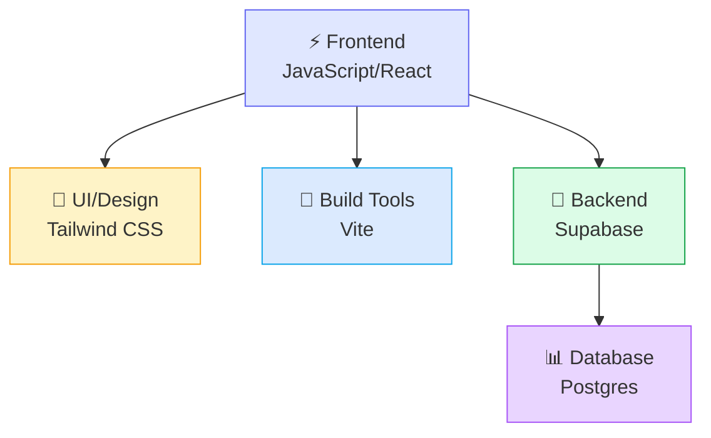

# تقنيات ومهارات مشروع Mesori

دليل شامل لكل التقنيات المستخدمة والمهارات المطلوبة لتطوير المشروع — من الأبسط (HTML/CSS) لحد الأعقد (Postgres RLS).

---

## 📊 نظرة عامة على التقنيات



---

## 1️⃣ Frontend — التقنيات الموجودة الآن

### React 18.2.0
**إيه هو:** JavaScript framework لبناء واجهات المستخدم بمكوّنات قابلة لإعادة الاستخدام.

**بتستخدمه فيه:**
- جميع الصفحات (`HomePage`, `QuizPage`, `ProfilePage`)
- إدارة حالة التطبيق (`AppContext`)
- المكوّنات البصرية (`Header`, `BottomNav`, `LevelCard`)

**المهارات المطلوبة:**
- ✅ JSX syntax (HTML داخل JavaScript)
- ✅ React hooks (`useState`, `useContext`, `useEffect`)
- ✅ Functional components
- ❌ لا تحتاج: Class components، Redux، Server-side rendering (حتى الآن)

**نقطة البدء:** أي React tutorial بسيط عن hooks.

---

### JavaScript (ES6+)
**المميزات المستخدمة:**
- Arrow functions: `() => {}`
- Destructuring: `const { x, y } = obj`
- Template literals: `` `Hello ${name}` ``
- Spread operator: `{ ...obj, newProp: value }`
- Array methods: `.map()`, `.find()`, `.filter()`

---

### Tailwind CSS 3.3.5
**إيه هو:** CSS utility-first framework — بدل ما تكتب CSS classes كبيرة، بتستخدم classes دقيقة زي `px-4 py-2 rounded-lg`.

**الـ utilities المستخدمة:**
```
Spacing:   px-4 py-3 gap-2
Sizing:    w-full h-32
Colors:    bg-white text-blue-600
Layout:    flex items-center justify-between
Corners:   rounded-2xl rounded-full
Shadows:   shadow-lg
Animation: transition-all duration-200 hover:
```

**التخصيص في مشروعك:**
- Colors custom من `tailwind.config.js`: `#C8922A`, `#3D2B1F`, `#2D6A3F`
- Font families: Cairo (العربي)، Cinzel (للعناوين)

**المهارات:**
- ✅ حفظ 20-30 class شائعة
- ✅ استخدام `style={{ backgroundColor: '#...' }}` للألوان ديناميكية
- ❌ لا تحتاج: كتابة CSS من الصفر

---

### Vite 5.0.0
**إيه هو:** أداة بناء سريعة جداً للمشاريع الحديثة.

**بتستخدمه لـ:**
- `npm run dev` → تشغيل سيرفر محلي مع hot reload
- `npm run build` → تجميع الكود لـ production

**لا تحتاج تعدّل في الإعدادات** — الـ `vite.config.js` موجود بالفعل.

---

### Flaticon Uicons 3.3.1
**إيه هو:** مكتبة أيقونات مجانية.

**الاستخدام:**
```jsx
<i className="fi fi-rr-check" /> ← أيقونة check
<i className="fi fi-rr-star" />  ← أيقونة نجمة
```

**الأيقونات المستخدمة الآن:**
- `fi-rr-check` / `fi-rr-cross` — إجابات صح/غلط
- `fi-rr-star` — نقاط
- `fi-rr-arrow-small-right` — الزر "التالي"
- `fi-rr-redo` — إعادة محاولة

**كيفية إضافة أيقونة جديدة:**
1. روح [uicons.flaticon.com](https://www.flaticon.com/uicons)
2. ابحث عن الأيقونة
3. انسخ class name (مثل `fi-rr-heart`)
4. استخدمها في الكود

---

## 2️⃣ Backend (الخطوات القادمة)

### Supabase
**إيه هو:** Platform جاهز يوفّر backend كامل: قاعدة بيانات Postgres + API + Auth + RLS.

**الأشياء اللي توفّرها:**
- ✅ Hosted Postgres database
- ✅ REST API (تتكلم مع قاعدة البيانات من JavaScript)
- ✅ Authentication (تسجيل الدخول بإيميل/باسورد)
- ✅ Row Level Security (RLS) — سياسات أمان على مستوى الصف

**التقنيات اللي هتستخدم معاها:**

#### 2.1 — Postgres / SQL
**المهارات الأساسية:**
- `CREATE TABLE` — إنشاء جداول
- `INSERT INTO` — إضافة بيانات
- `SELECT` — استعلام البيانات
- `UPDATE` — تعديل البيانات
- Foreign Keys — الربط بين الجداول
- Transactions — تنفيذ عمليات متعددة بأمان

**المهارات المتقدمة (المرحلة 4 لاحقاً):**
- `CREATE FUNCTION` — دوال محفوظة (stored procedures)
- `SECURITY DEFINER` — تنفيذ دالة بصلاحيات إدارية
- Triggers — تنفيذ إجراء تلقائي عند حدث معين

**نقطة البدء:** موقع [sqlzoo.net](https://sqlzoo.net/) للتعلم التفاعلي.

---

#### 2.2 — Supabase JavaScript Client
```javascript
import { createClient } from '@supabase/supabase-js'

const supabase = createClient(url, anonKey)

// قراءة
const { data, error } = await supabase
  .from('questions')
  .select('*')
  .eq('stage_id', 1)

// إضافة
await supabase.from('profiles').insert({ 
  username: 'Omar', 
  character: 'boy' 
})
```

**ليست العمليات:**
- `.select()` — استعلام
- `.insert()` — إضافة
- `.update()` — تعديل
- `.delete()` — حذف
- `.eq()` — condition (مثل WHERE)
- `.rpc()` — استدعاء دالة Postgres

---

#### 2.3 — Supabase Auth
```javascript
// التسجيل
await supabase.auth.signUp({
  email: 'user@example.com',
  password: '...'
})

// تسجيل الدخول
await supabase.auth.signInWithPassword({
  email: 'user@example.com',
  password: '...'
})

// التحقق من الجلسة
const { data } = await supabase.auth.getSession()
```

**المفاهيم:**
- Session — معلومات المستخدم الحالي
- JWT Token — شهادة تثبت هويتك للسيرفر
- لا تحتاج حفظ password في React — Supabase بتتعامل معه بأمان

---

#### 2.4 — Row Level Security (RLS)
**إيه هو:** سياسات في قاعدة البيانات بتتحكم من اللي يقدر يشوف/يعدّل الحاجات.

**مثال:**
```sql
-- المستخدم يقدر يقرأ صفه هو بس
CREATE POLICY "users_see_own_profile" ON profiles
  FOR SELECT
  USING (auth.uid() = id);

-- الجميع يقدر يقرأ الأسئلة
CREATE POLICY "public_read_questions" ON questions
  FOR SELECT
  USING (true);
```

**الفكرة:** بدل ما تحط filters في React (اللي أي حد يقدر يحذفها من DevTools)، الفلتر يكون في قاعدة البيانات نفسها — مضمون 100%.

---

## 3️⃣ لاحقاً — لما تنتقل لـ Next.js

### Next.js 14
**إيه هو:** Framework React متقدم — يوفّر routing، server-side rendering، وRoute Handlers.

**الفرق مع React العادي:**
- Pages auto-routing (ملفات في `app/` folder بتتحول لـ routes تلقائياً)
- API Routes (endpoint في `/api/` لتنفيذ كود في سيرفر بدل المتصفح)
- Server Components (كود جوه السيرفر، مش في المتصفح)

**متى تحتاجه؟** لما تحتاج إخفاء الإجابات الصحيحة تماماً (الـ`questions` JSON مش بترسل للمتصفح أصلاً).

---

## 📚 خريطة المهارات حسب المرحلة

### المرحلة الحالية (Frontend فقط) — ✅ اكتملت
**المهارات المطلوبة:**
- React hooks و JSX
- Tailwind CSS classes
- JavaScript ES6+ basics

**الأدوات:**
- VS Code أو أي editor
- npm / node.js

---

### المرحلة 1-2 (Supabase Read-only)
**مهارات جديدة:**
- SQL SELECT basics
- Supabase dashboard navigation
- Async/await في JavaScript
- `.then()` / `.catch()` for promises

**وقت التعلم:** 2-3 ساعات (إذا جديد على الـ backend)

---

### المرحلة 3 (Auth)
**مهارات جديدة:**
- فهم JWT tokens
- Session management
- Supabase Auth API

**وقت التعلم:** 1-2 ساعة

---

### المرحلة 4 (Real Points)
**مهارات متقدمة:**
- SQL CREATE FUNCTION
- SECURITY DEFINER
- Transactions
- مبدأ "Never Trust the Client"

**وقت التعلم:** 3-4 ساعات

---

### المرحلة 5 (Next.js)
**مهارات جديدة تماماً:**
- Next.js App Router
- Server vs Client Components
- API Routes / Route Handlers
- Middleware

**وقت التعلم:** يوم كامل على الأقل

---

## 🎯 المهارات الناقصة حالياً وكيفية سدّ الفجوة

| المهارة | الحالة | المصدر |
|--------|--------|--------|
| **React Hooks** | ✅ تستخدمه | [React official docs](https://react.dev/reference/react/hooks) |
| **Tailwind CSS** | ✅ تستخدمه | [Tailwind docs](https://tailwindcss.com/docs) + practice |
| **SQL basics** | ❌ قريباً | [SQLZoo](https://sqlzoo.net/) أو [Khan Academy](https://www.khanacademy.org/) |
| **Supabase API** | ❌ المرحلة 2 | [Supabase docs](https://supabase.com/docs) |
| **Authentication** | ❌ المرحلة 3 | Supabase Auth Tutorial + practice |
| **SQL Functions/RLS** | ❌ المرحلة 4 | Supabase RLS docs + examples |
| **Next.js** | ❌ المرحلة 5 | [Next.js official tutorial](https://nextjs.org/learn) |

---

## 🔧 الأدوات والبرامج المطلوبة

### حتمي
- **Node.js** (v16+) — لتشغيل `npm` و `npm run dev`
- **Code Editor** — VS Code موصّى به جداً (مجاني)
- **Git** (اختياري حالياً، حتمي لو اشتغلت مع حد تاني)
- **متصفح حديث** — Chrome/Firefox (عشان DevTools)

### اختياري (لكن مفيد)
- **GitHub account** — لحفظ الكود online
- **Supabase account** — عشان المراحل القادمة (مجاني مع حدود)
- **Postman** أو **Thunder Client** — لاختبار API requests بدون كود

---

## 💡 الأشياء اللي الكود الحالي مجهّز ليها بالفعل

لو رجعت تقرأ التعليقات في الملفات دي هتلاقي استعلامات Supabase جاهزة:

```javascript
// في AppContext.jsx
// const { data } = await supabase.from('profiles').select('*').eq('id', user.id)

// في levels.js
// const { data: levels } = await supabase.from('levels').select(`
//   id, name_ar, max_points, stages (id, title, ...)
// `)
```

يعني الكود الحالي مش random — كاتب مأخوذ من دليل Supabase الرسمي — بس تعليقات لحد الآن. لما تستعد للمرحلة 2 بتستبدل الـ comments بـ code حقيقي بس.

---

## 📈 مخطط تعقيد المهارات

```
Difficulty
    ▲
    │         ┌─ Next.js
    │         │ (المرحلة 5)
    │     ┌───┤
    │     │   └─ SQL Functions
    │     │      (المرحلة 4)
    │  ┌──┤
    │  │  └─ Auth + RLS
    │  │     (المرحلة 3)
    │  │
    │  └─ Supabase Read
    │     (المرحلة 2)
    │
    └──────────────────────► Time
    React
    (الآن)
```

---

## 🎓 طريقة التعلم الموصى بها

1. **اقرأ الـ BACKEND_GUIDE.md** — فهم الصورة الكبيرة قبل كودة
2. **ابدأ بالمرحلة 1** — إعداد Supabase وكتابة SQL جداول
3. **شغّل المرحلة 2** — اربط الـ frontend بـ Supabase لأول مرة
4. **لما تحتاج المزيد** — انتقل للمرحلة الجاية

لا تحاول تتعلم Next.js قبل ما تستقر المراحل 1-4 — هتضيع وقتك.

---

## ✅ Checklist للبدء

- [ ] عندك Node.js مثبت (`node --version`)
- [ ] عندك VS Code أو editor
- [ ] عندك اتصال إنترنت (للـ Supabase)
- [ ] قريت BACKEND_GUIDE.md
- [ ] عندك Supabase account (اختياري حتى الآن)
