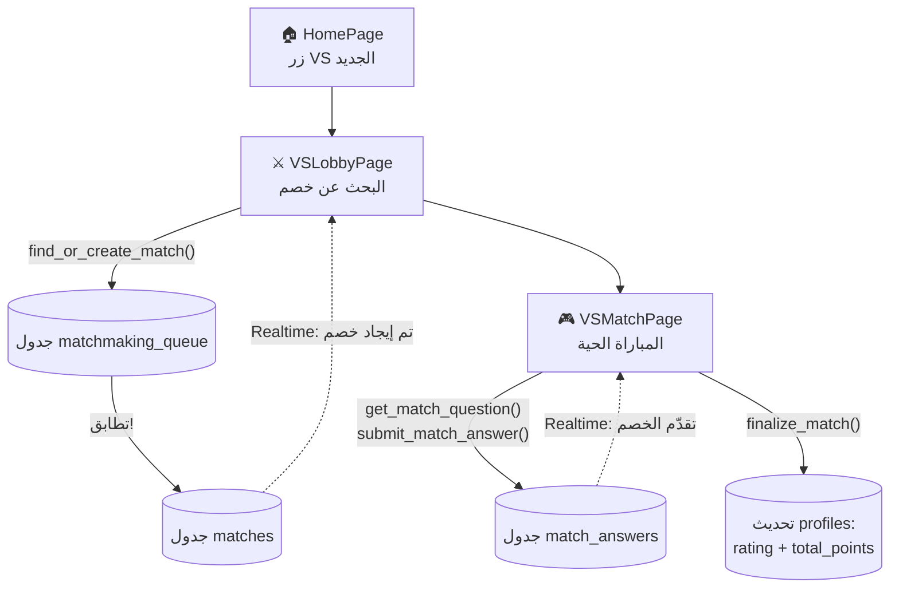
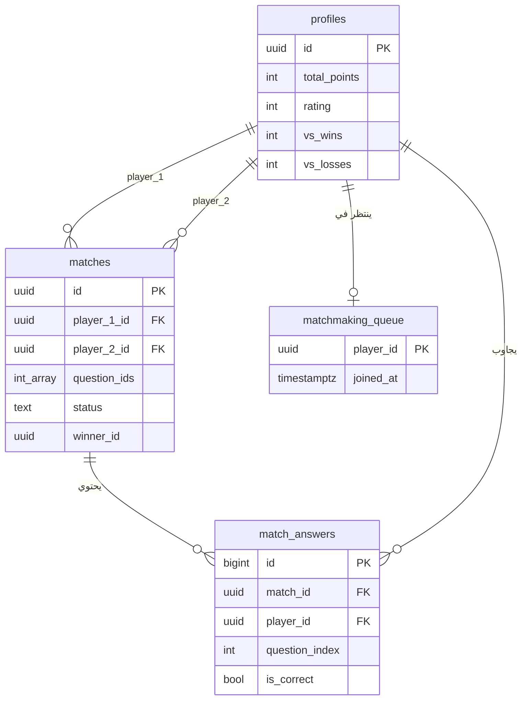
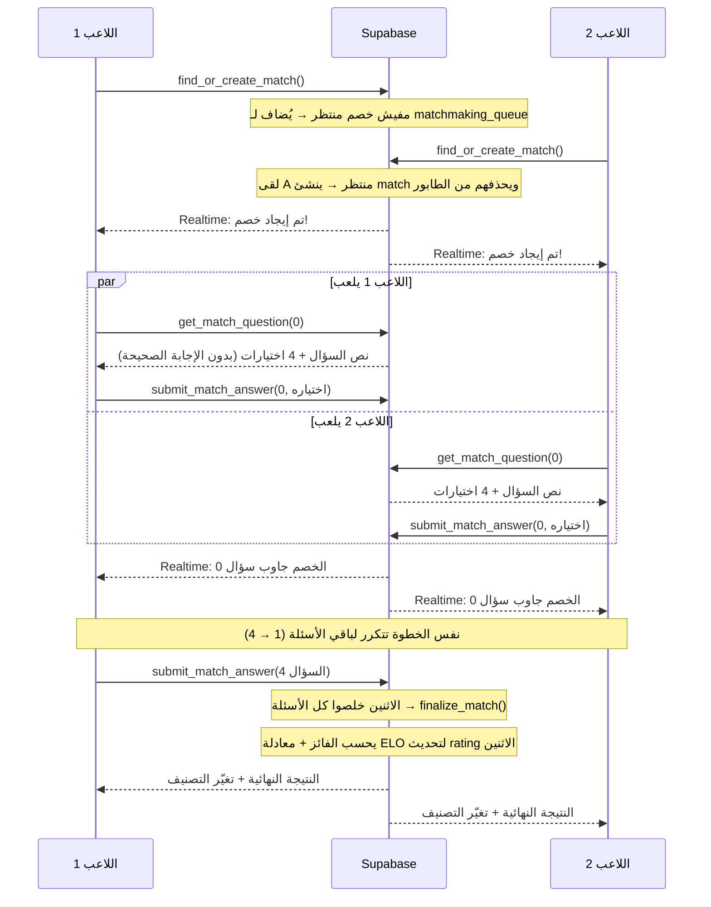
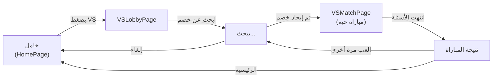

# دليل وضع VS — منافسة 1 ضد 1 في Mesori

خطة شاملة لإضافة وضع منافسة أونلاين: لاعب ضد لاعب في معرفتهم بالحضارة المصرية القديمة، بزر "VS" جديد تحت أيقونة الصوت في الصفحة الرئيسية.

---

## ⚠️ تنبيه مهم قبل أي حاجة

راجعت الـ repo بتاعك الآن (commit `0bb99e5 home page done`)، ولاحظت إن آخر تحديث فيه **لا يحتوي على `QuizPage.jsx` و`quizzes.js`** اللي بنيناهم مع بعض في الجلسة اللي فاتت — لسه نفس النسخة اللي قبلهم. يبدو إن الـ zip اللي بعتّهولك ما اتـ push للـ GitHub بعد (لو ده مقصود لسبب معيّن، تجاهل الملاحظة).

الخطة دي مبنية على افتراض إن `QuizPage.jsx`/`quizzes.js` **موجودين فعلياً** في مشروعك (حتى لو مش على GitHub بعد)، لأن وضع VS هيعيد استخدام مكوّنات منهم. **قبل ما تبدأ Phase A هنا، لازم:**
1. تعمل push للتغييرات دي على GitHub الأول
2. تكمّل Phase 1-3 من `BACKEND_GUIDE.md` (الجداول + القراءة + تسجيل الدخول) — وضع VS مش هيشتغل من غير قاعدة بيانات حقيقية وهوية لاعبين حقيقية.

---

## 📍 الوضع الحالي وما تم إنجازه

| الجزء | الحالة |
|------|--------|
| Frontend — الصفحة الرئيسية، Leaderboard، Profile | ✅ مبني بالكامل |
| Frontend — QuizGroupPage (اختيار المرحلة) | ✅ مبني بالكامل |
| Frontend — QuizPage (الاختبار الفردي) | ✅ مبني (تأكد من الـ push، راجع التنبيه فوق) |
| Backend — Supabase (جداول، Auth، RLS) | ❌ لسه في مرحلة التخطيط (`BACKEND_GUIDE.md`) — لم يُنفَّذ فعلياً بعد |
| **وضع VS (المطلوب هنا)** | ❌ لم يبدأ — هذا الملف هو خطته الكاملة |

يعني: وضع VS هو **الخطوة اللي بعد** ما تخلّص المراحل الأساسية في `BACKEND_GUIDE.md`، مش بديل عنها ولا موازي ليها.

---

## 1. نظرة عامة على وضع VS

اللاعب يضغط زرار "VS" الجديد تحت أيقونة الصوت → يدخل صالة انتظار → يتطابق مع لاعب تاني بيدور على مباراة كمان → الاثنين ياخدوا **نفس 5 أسئلة بالظبط** (عشوائية من بنك الأسئلة) → كل واحد بيجاوب بالسرعة بتاعته وشايف تقدّم خصمه لحظياً → اللي يجاوب أكتر صح يكسب (والأسرع في حالة التعادل بالنقاط) → التصنيف والنقاط بتتحدّث للاثنين.



---

## 2. قرارات تصميمية تستاهل تفهمها (وتتصرف فيها لو مش موافق)

**التصنيف (rating) منفصل عن نقاط التقدّم (total_points):**
كتبت في طلبك "نقاط تضاف للسكور الكلي" و"رفع تصنيفك" كأنهم حاجة واحدة، لكن رأيي إنهم لازم يبقوا حقلين منفصلين:
- `total_points` (موجود بالفعل) = عملة تراكمية من التقدّم الفردي، بتزيد بس، مبتنزلش
- `rating` (جديد) = تصنيف تنافسي على طريقة الشطرنج (ELO)، بيزيد وينقص حسب قوة خصمك، ده اللي فعلياً معنى "تصنيفك كلاعب"

الفوز في VS بيدّيك الاثنين: نقاط تُضاف لـ `total_points` (زي أي مصدر نقاط تاني)، والتصنيف `rating` يتغيّر حسب قوة اللي قابلته. لو حبيت الأبسط (نقاط بس من غير ELO)، قوللي وأبسّط الخطة.

**عدد الأسئلة: 5 لكل مباراة**، مش 10 زي الاختبار الفردي — مباراة أسرع وأكثر قابلية للإعادة. الأسئلة عشوائية من كل بنك الأسئلة (مش مقتصرة على مرحلة معيّنة)، لأن الهدف هنا "مين أعرف بمصر القديمة عموماً" مش تتبّع منهج.

**⚠️ اعتماد مهم:** بنك الأسئلة عندك حالياً 10 أسئلة بس (مرحلة 1-1). وضع VS بيسحب 5 عشوائية من هذه العشرة — يعني أول كام مباراة هتتكرر فيهم أسئلة كتير. جودة الوضع ده مرتبطة مباشرة بعدد الأسئلة الحقيقية اللي هتضيفها (خطوة "إضافة الأسئلة الحقيقية" في `README.md`).

**بدون مؤقّت (timer) في النسخة الأولى** — كل لاعب بيجاوب بسرعته، والفوز للأصح ثم الأسرع عند التعادل. مؤقّت لكل سؤال (زي 15 ثانية) ممكن يتضاف لاحقاً، لكنه محتاج تعامل إضافي مع تأخير الشبكة والخلاف حول "هل وصلت الإجابة في الوقت؟" — أفضّل نأجّله لحد ما الأساسيات تشتغل صح.

**التزامن الحي مش "نفس اللحظة بالظبط":** كل لاعب ياخد نفس الأسئلة ونفس الترتيب، لكن بيتقدّم بسرعته، وبيشوف تقدّم خصمه لحظياً عبر Realtime (مش تزامن "لازم الاثنين يجاوبوا في نفس الثانية"). ده أبسط بكتير من نظام "قفل الخطوة" (lockstep) وبيدّي إحساس تنافسي حي كفاية بدون تعقيد إدارة الانقطاع/التأخير.

---

## 3. تصميم قاعدة البيانات



```sql
-- امتدادات على profiles الموجود بالفعل (من BACKEND_GUIDE.md)
ALTER TABLE profiles ADD COLUMN rating     integer NOT NULL DEFAULT 1000;
ALTER TABLE profiles ADD COLUMN vs_wins    integer NOT NULL DEFAULT 0;
ALTER TABLE profiles ADD COLUMN vs_losses  integer NOT NULL DEFAULT 0;
ALTER TABLE profiles ADD COLUMN vs_draws   integer NOT NULL DEFAULT 0;

-- طابور البحث عن خصم (صف واحد لكل لاعب بيدور)
CREATE TABLE matchmaking_queue (
  player_id  uuid PRIMARY KEY REFERENCES auth.users(id),
  joined_at  timestamptz NOT NULL DEFAULT now()
);

-- المباراة نفسها
CREATE TABLE matches (
  id                      uuid PRIMARY KEY DEFAULT gen_random_uuid(),
  player_1_id             uuid NOT NULL REFERENCES auth.users(id),
  player_2_id             uuid NOT NULL REFERENCES auth.users(id),
  question_ids            integer[] NOT NULL,   -- نفس 5 الأسئلة لكل اللاعبين
  status                  text NOT NULL DEFAULT 'in_progress'
                            CHECK (status IN ('in_progress','finished','abandoned')),
  winner_id               uuid REFERENCES auth.users(id),  -- null = تعادل
  player_1_rating_change  integer,
  player_2_rating_change  integer,
  created_at              timestamptz NOT NULL DEFAULT now(),
  finished_at             timestamptz
);

-- كل إجابة (بتسمح بمزامنة التقدّم اللحظي بين اللاعبين)
CREATE TABLE match_answers (
  id              bigint GENERATED ALWAYS AS IDENTITY PRIMARY KEY,
  match_id        uuid NOT NULL REFERENCES matches(id),
  player_id       uuid NOT NULL REFERENCES auth.users(id),
  question_index  integer NOT NULL,
  selected_index  integer NOT NULL,
  is_correct      boolean NOT NULL,   -- يُحسب من السيرفر، مش من العميل
  answered_at     timestamptz NOT NULL DEFAULT now(),
  UNIQUE (match_id, player_id, question_index)
);
```

**تنبيه أمان أهم هنا من الوضع الفردي:** في الاختبار الفردي، معرفة `correct_index` من DevTools مشكلة بسيطة (بتضر نفسك بس). هنا بتضر **خصمك** كمان — لو لاعب شاف الإجابة الصحيحة قبل ما يجاوب، كسب ظالم على حساب حد تاني حقيقي. عشان كده RPC استرجاع السؤال (Phase B) لازم **ميرجعش `correct_index` للعميل أبداً**، والتحقق من صحة الإجابة يحصل بالكامل جوه قاعدة البيانات.

---

## 4. دورة حياة المباراة الكاملة



**معادلة التصنيف (ELO مبسّطة):**
```
الاحتمال_المتوقع_للاعب_أ = 1 / (1 + 10^((تصنيف_ب - تصنيف_أ) / 400))
التصنيف_الجديد_لأ = تصنيف_أ + K × (النتيجة_الفعلية - الاحتمال_المتوقع)

النتيجة_الفعلية: فوز = 1، تعادل = 0.5، خسارة = 0
K = 32 (ثابت قابل للتعديل — كل ما زاد، كل مباراة تأثيرها أكبر)
```

---

## 5. تدفق الواجهة (Frontend)



**الصفحات الجديدة المطلوبة** (بنفس تصميم/فونت/ألوان المشروع الحالي):
- `VSLobbyPage.jsx` (`currentPage = 'vs-lobby'`) — يعرض تصنيفك الحالي، زرار "ابحث عن خصم"، حالة انتظار، اشتراك Realtime لحظة التطابق
- `VSMatchPage.jsx` (`currentPage = 'vs-match'`, `pageData = { matchId }`) — يحتوي حالتين داخليتين (زي `QuizPage.jsx`): مباراة حية، ثم نتيجة — بدل صفحتين منفصلتين

**تعديل بسيط على الموجود:**
- `Header.jsx` — زرار VS يظهر تحت زرار الصوت بس (prop اختياري جديد)
- استخراج `AnswerOption` من `QuizPage.jsx` لملف مشترك، عشان `VSMatchPage.jsx` يستخدم نفس شكل الاختيارات بالظبط

---

## 6. الخطط والمهام (Prompts جاهزة بالترتيب)

> ذكّرت في كل Prompt بالسياق المطلوب، لكن الأفضل ترفق هذا الملف نفسه + `BACKEND_GUIDE.md` مع أي محادثة Claude جديدة تبدأها بمهمة من هنا.

### Phase A — قاعدة بيانات المنافسة

#### المهمة A.1 — الجداول والصلاحيات
```
مشروع Mesori (React + Vite + Supabase). عندي بالفعل جداول profiles/levels/
stages/questions/user_progress زي BACKEND_GUIDE.md. عايز أضيف نظام منافسة
1 ضد 1. الصق قسم "تصميم قاعدة البيانات" من VS_MODE_GUIDE.md هنا].

عايزك:
1. تكتب SQL migration فيه: أعمدة جديدة على profiles (rating, vs_wins,
   vs_losses, vs_draws)، وجداول matchmaking_queue وmatches وmatch_answers
   بالضبط بالشكل الموضّح
2. RLS policies: كل لاعب يشوف/يعدّل صفه بس في matchmaking_queue، كل لاعب
   يشوف matches وmatch_answers اللي هو طرف فيها بس (player_1_id أو
   player_2_id = auth.uid())، وممنوع أي INSERT/UPDATE مباشر على matches
   أو match_answers من العميل — كل التعديل هيحصل عبر RPC functions بس
   (هنكتبها في المهام الجاية)

اشرحلي ليه منعنا الـ INSERT/UPDATE المباشر.
```

**هتتأكد إنها اشتغلت لما:** تفتح Table Editor وتلاقي الجداول الأربعة (مع الأعمدة الجديدة في profiles) موجودة، وتجرّب INSERT مباشر في matches من الـ SQL Editor بحساب مش بتاعك — المفروض يترفض.

---

#### المهمة A.2 — دالة إنهاء المباراة وحساب ELO
```
[الصق قسم "دورة حياة المباراة" ومعادلة ELO من VS_MODE_GUIDE.md]

عايزك تكتب Postgres function اسمها finalize_match(match_id) بصلاحية
SECURITY DEFINER تعمل:
1. تتأكد إن اللاعبين الاثنين جاوبوا على كل الأسئلة في question_ids
   (لو لأ، ما تعملش حاجة)
2. تحسب عدد الإجابات الصحيحة لكل لاعب من match_answers
3. تحدد الفائز: الأكثر صح، وعند التعادل في العدد يفوز الأسرع
   (أول answered_at لآخر سؤال)
4. تطبّق معادلة ELO (K=32) لحساب rating الجديد للاعبين، وتحدّث
   profiles.rating وprofiles.vs_wins/vs_losses/vs_draws
5. تحدّث matches.status = 'finished' وmatches.winner_id ومقدار تغيّر
   التصنيف لكل لاعب
كل ده في transaction واحدة.

اشرحلي إزاي التعادل بيتعامل معاه في معادلة ELO.
```

**هتتأكد إنها اشتغلت لما:** تعمل صفين وهميين في match_answers لمباراة تجريبية وتستدعي الدالة يدوياً من SQL Editor، وتتحقق إن `profiles.rating` اتغيّر بالقيمة الصح حسابياً.

---

### Phase B — منطق المطابقة والمباراة

#### المهمة B.1 — المطابقة بين لاعبين
```
[الصق قسم "دورة حياة المباراة" من VS_MODE_GUIDE.md]

عايزك تكتب Postgres function اسمها find_or_create_match() بصلاحية
SECURITY DEFINER:
1. تتأكد الأول إن اللاعب مالوش match بحالة 'in_progress' بالفعل
   (لو عنده، ترجّع الـ match_id الموجود بدل ما تعمل واحدة جديدة)
2. تدوّر جوه matchmaking_queue عن أي لاعب تاني منتظر (باستخدام
   SELECT ... FOR UPDATE SKIP LOCKED عشان تتجنب إن لاعبين يمسكوا
   نفس الخصم في نفس اللحظة)
3. لو لقت حد: تسحب 5 أسئلة عشوائية من جدول questions، تنشئ صف جديد
   في matches، تمسح الاثنين من matchmaking_queue، ترجّع match_id
4. لو محدش موجود: تضيف اللاعب الحالي لـ matchmaking_queue، ترجّع null

اشرحلي بالتفصيل ليه SKIP LOCKED مهمة هنا ووإيه اللي كان ممكن يحصل
غلط من غيرها.
```

**هتتأكد إنها اشتغلت لما:** تفتح المشروع في نافذتين متصفح بحسابين مختلفين، تستدعي الدالة من الاثنين بفارق ثواني، وتتأكد إنهم اتربطوا في نفس match_id واحد بس (مش اتنين منفصلين، ومفيش حد اتقفل في الطابور من غير خصم).

---

#### المهمة B.2 — أسئلة المباراة والإجابة عليها
```
[الصق قسم "تنبيه أمان" و"تصميم قاعدة البيانات" من VS_MODE_GUIDE.md]

عندي جدول matches فيه question_ids (array). عايزك تكتب دالتين:

1. get_match_question(match_id, question_index) — SECURITY DEFINER:
   تتأكد إن اللاعب المستدعي طرف في المباراة دي فعلاً، ترجّع نص السؤال
   والاختيارات الأربعة بس — بدون correct_index نهائياً، ولا حتى جوه
   استجابة الدالة نفسها

2. submit_match_answer(match_id, question_index, selected_index) —
   SECURITY DEFINER: تتأكد إن اللاعب طرف في المباراة، تتأكد إن مفيش
   إجابة سابقة لنفس السؤال (منع التكرار)، تجيب correct_index الحقيقي
   من جدول questions وتقارنه هي نفسها (مش تصدّق أي قيمة is_correct
   جاية من العميل)، تسجّل الإجابة في match_answers، ولو ده كان آخر
   سؤال ولاعب المباراة التاني خلص برضه، تستدعي finalize_match()
   تلقائياً

اعرض عليّ كود الدالتين وأشرحلي فين بالظبط بنمنع تسريب الإجابة الصحيحة.
```

**هتتأكد إنها اشتغلت لما:** تفتح Network tab في DevTools وانت بتلعب، وتتأكد إن أي response من get_match_question مافيهوش correct_index، وتجرّب تستدعي submit_match_answer لنفس السؤال مرتين — المفروض التكرار يترفض.

---

#### المهمة B.3 — التعامل مع الانقطاع
```
[الصق قسم "قرارات تصميمية" من VS_MODE_GUIDE.md]

عايزك تكتب دالة forfeit_abandoned_match(match_id) — SECURITY DEFINER:
لو مرّ وقت معيّن (مثلاً 5 دقايق) من غير أي نشاط من أحد اللاعبين
(آخر answered_at أو created_at للمباراة)، تسمح للاعب التاني (النشط)
يستدعيها ليعلن فوزه تلقائياً (winner = هو، والتاني يتحسب خسارة).

كمان عدّل find_or_create_match() (من المهمة B.1) عشان لو لاعب عنده
match قديمة 'in_progress' عدّت عليها أكتر من 5 دقايق من غير نشاط،
تتحول لـ 'abandoned' تلقائياً قبل ما يقدر يدخل مباراة جديدة.
```

**هتتأكد إنها اشتغلت لما:** تبدأ مباراة وتسيب نافذة واحدة من غير ما تجاوب لمدة الفترة المحددة، وتتأكد إن اللاعب التاني يقدر يستدعي الدالة ويكسب.

---

### Phase C — واجهة الدخول لوضع VS

#### المهمة C.1 — زرار VS في الهيدر والراوتنج
```
مشروع Mesori (React + Vite). عايز أضيف زرار "VS" جديد تحت زرار الصوت
في الصفحة الرئيسية بس (أعلى اليسار). [الصق src/components/layout/
Header.jsx و src/pages/HomePage.jsx و src/App.jsx و src/context/
AppContext.jsx]

عايزك:
1. تعدّل Header.jsx: لما showSound=true ويتمرر prop جديد اسمه
   onVSClick، اعرض زرار الصوت وزرار VS جنب بعض عمودياً (flex-col،
   gap صغير) بدل زرار الصوت لوحده. زرار VS دايرة بيضاء زي باقي
   أزرار الهيدر بالظبط (نفس rounded-2xl, shadow-card, press-effect)،
   وجواها نص "VS" بخط Cinzel بولد بدل أيقونة
2. عدّل HomePage.jsx يمرر onVSClick={() => navigateTo('vs-lobby')}
3. أضف 'vs-lobby' لتعليق قائمة الصفحات في AppContext.jsx، وأضف
   case 'vs-lobby' في App.jsx (استورد VSLobbyPage حتى لو لسه ملفها
   فاضي هننشئه بعدين)

خليك ملتزم تماماً بنفس نظام الألوان والخطوط الموجود، من غير ما تلمس
أي زرار تاني.
```

**هتتأكد إنها اشتغلت لما:** تفتح الصفحة الرئيسية وتلاقي زرارين فوق بعض (الصوت والـ VS) بنفس الشكل، والضغط على VS يوديك لصفحة فاضية بس بيانتقل صح.

---

#### المهمة C.2 — صالة الانتظار
```
[الصق قسم "تدفق الواجهة" من VS_MODE_GUIDE.md، و src/pages/
QuizGroupPage.jsx كمرجع للتصميم، و src/context/AppContext.jsx]

عايزك تبني VSLobbyPage.jsx جديدة:
1. تعرض تصنيف اللاعب الحالي (rating) وعدد فوز/خسارة (اجلبهم من
   profiles عبر supabase — لو مش موصول بعد، استخدم قيم وهمية بنفس
   الشكل مؤقتاً)
2. زرار "ابحث عن خصم" كبير — بيستدعي find_or_create_match() RPC
3. لو رجعت match_id فوراً (لقى خصم جاهز)، انتقل لـ VSMatchPage مباشرة
   عبر navigateTo('vs-match', { matchId })
4. لو رجعت null (محدش لسه)، اعرض حالة "بيدور على خصم..." بأنيميشن
   بسيط، واشترك في Realtime على جدول matches فلترة بـ
   player_1_id=eq.{userId},player_2_id=eq.{userId} — لحظة ما ييجي
   صف جديد، انتقل تلقائياً لـ VSMatchPage
5. زرار "إلغاء" أثناء البحث يمسح صف اللاعب من matchmaking_queue
   ويرجعه للصفحة الرئيسية

استخدم نفس أسلوب التعليقات العربية المكثفة الموجود في باقي المشروع.
```

**هتتأكد إنها اشتغلت لما:** تفتح المشروع في نافذتين بحسابين مختلفين، تضغط "ابحث عن خصم" في الاثنين بفارق ثواني، وتشوف الاثنين بينتقلوا لـ VSMatchPage تلقائياً من غير refresh يدوي.

---

### Phase D — تجربة المباراة الحية

#### المهمة D.1 — استخراج مكوّن الاختيارات المشترك
```
[الصق src/pages/QuizPage.jsx كامل]

عايزك تستخرج مكوّن AnswerOption من داخل QuizPage.jsx لملف مستقل
src/components/shared/AnswerOption.jsx بنفس الكود بالظبط، وتعدّل
QuizPage.jsx يستورده من الملف الجديد بدل ما يكون معرّف جواه. تأكد إن
سلوك QuizPage.jsx ما اتغيّرش نهائياً — التعديل ده تنظيمي بس عشان
هنحتاج نفس المكوّن في VSMatchPage.jsx الجاية.
```

**هتتأكد إنها اشتغلت لما:** تشغّل `npm run dev` وتلعب اختبار فردي عادي — لازم يبقى بالظبط زي الأول، بدون أي فرق.

---

#### المهمة D.2 — صفحة المباراة الحية والنتيجة
```
[الصق قسم "تدفق الواجهة" و"دورة حياة المباراة" من VS_MODE_GUIDE.md،
و src/pages/QuizPage.jsx و src/components/shared/AnswerOption.jsx
(من المهمة السابقة) كمرجع تصميم]

عايزك تبني VSMatchPage.jsx (pageData = { matchId })، فيها حالتين
داخليتين زي QuizPage.jsx بالظبط (مش صفحتين منفصلتين):

**حالة المباراة الحية:**
- تجيب السؤال الحالي عبر get_match_question(matchId, questionIndex)
- تعرضه بنفس شكل QuizPage.jsx (نفس بطاقة السؤال، ونفس AnswerOption)
- عند الاختيار: submit_match_answer(matchId, questionIndex, selected)
- شريط تقدّم لك وشريط تقدّم منفصل أصغر لخصمك (تحديثه لحظي عبر Realtime
  اشتراك على match_answers فلترة بـ match_id=eq.{matchId})
- عند آخر سؤال، بعد submit، انتقل لحالة النتيجة محلياً

**حالة النتيجة:**
- اعرض عدد إجاباتك الصحيحة مقابل خصمك، مين فاز، وتغيّر التصنيف
  (+/- كام نقطة)، بنفس روح شاشة نتيجة QuizPage.jsx لكن بمقارنة لاعبين
- زرار "مباراة تانية" → navigateTo('vs-lobby')
- زرار "الرئيسية" → navigateTo('home')

خليك ملتزم بنفس نظام الألوان/الخطوط/الـ press-effect الموجود.
```

**هتتأكد إنها اشتغلت لما:** تلعب مباراة كاملة بين حسابين في نافذتين، وتشوف تقدّم كل واحد بيتحدّث عند التاني لحظياً، والنتيجة النهائية وتغيّر التصنيف بيظهروا صح للاثنين.

---

## 7. اعتبارات لاحقة (مش لازمة للنسخة الأولى)

- **مؤقّت لكل سؤال:** يحتاج تعامل مع تأخير الشبكة، أفضل بعد ما الأساسيات تستقر
- **مؤشر "الخصم متصل الآن":** عبر Supabase Realtime Presence بدل الاعتماد على answered_at بس
- **منع التلاعب بالتصنيف (rating manipulation):** لاعب ممكن يعمل حسابين ويخسر لنفسه عمداً لرفع تصنيف حساب معيّن. صعب تمنعه بالكامل من غير بنية أكبر (rate limiting، كشف أنماط)، يستاهل تفكير لاحقاً لو التطبيق كبر فعلاً
- **حجم بنك الأسئلة:** زي ما ذكرت فوق، وضع VS هيحتاج عشرات/مئات الأسئلة عشان يفضل ممتع — مرتبط مباشرة بخطوة "الأسئلة الحقيقية" في README.md
